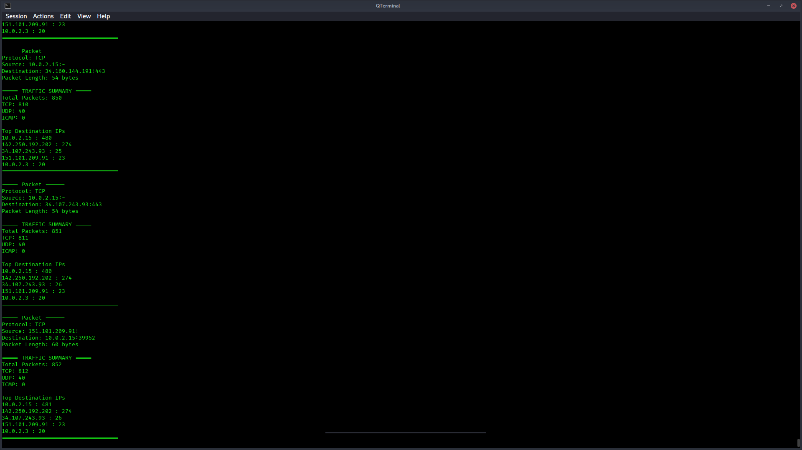

# Packet Analyzer (CLI)

A CLI-based network packet analyzer built using Python and Scapy to monitor real-time traffic, filter protocols, and analyze network behavior.

This project demonstrates low-level packet inspection, protocol parsing, and real-time traffic statistics — similar to simplified tools like Wireshark (CLI version).
---

## Features

- Real-time packet capture using Scapy
- Protocol detection (TCP, UDP, ICMP)
- Source & destination IP + port extraction
- Protocol-based filtering via CLI
- Live traffic statistics (packet counts)
- Top destination IP tracking

---

## How It Works

1. Captures packets using Scapy
2. Parses protocol and header information
3. Filters packets based on user input
4. Updates real-time traffic statistics
5. Displays structured output in CLI

---

## Limitations

- Requires root privileges to capture packets
- CLI-based (no GUI)
- Limited deep packet inspection (no payload decoding)

---

## Future Improvements

- Add packet rate monitoring (packets/sec)
- Save logs to file
- Build a GUI dashboard
- Add anomaly detection (basic IDS)

---

## Project Structure

packet-analyzer/
│
├── analyzer/
│   ├── sniffer.py
│   ├── parser.py
│   ├── statistics.py
│
├── main.py
├── requirements.txt
└── README.md

---

## Installation

git clone <https://github.com/nayandebnath1211-tech/packet-analyzer>
cd packet-analyzer
pip install -r requirements.txt

---

## Usage

Run the analyzer:
sudo python3 main.py

Filter by protocol:
sudo python3 main.py --protocol tcp

Specify network interface:
sudo python3 main.py --interface eth0

---

## Example Output

---

## Tech Stack

* Python
* Scapy
* CLI (argparse)

---

## Key Concepts Learned

* Network packet structure (IP, TCP, UDP, ICMP)
* Real-time packet capture
* Data parsing and analysis
* CLI tool development
* Modular software design

---

## Disclaimer

This tool is for educational purposes only.
Use responsibly on networks you own or have permission to analyze.

---

